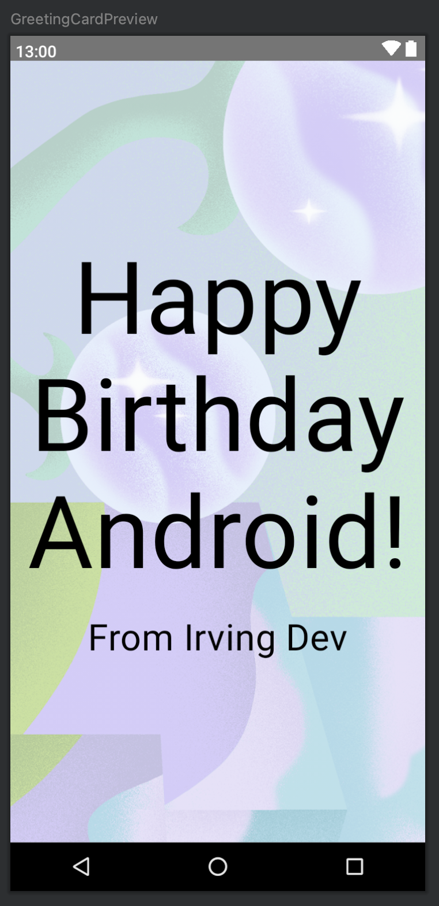
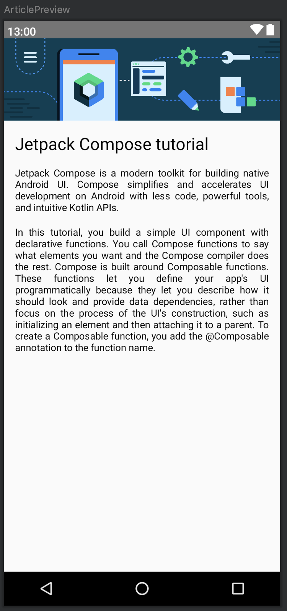
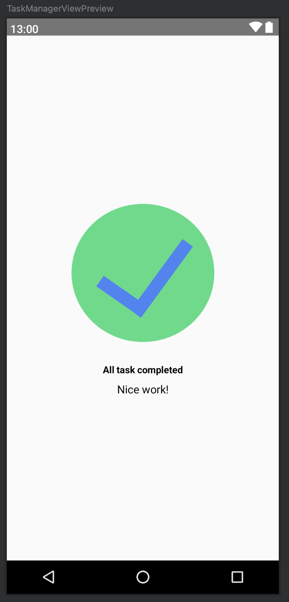
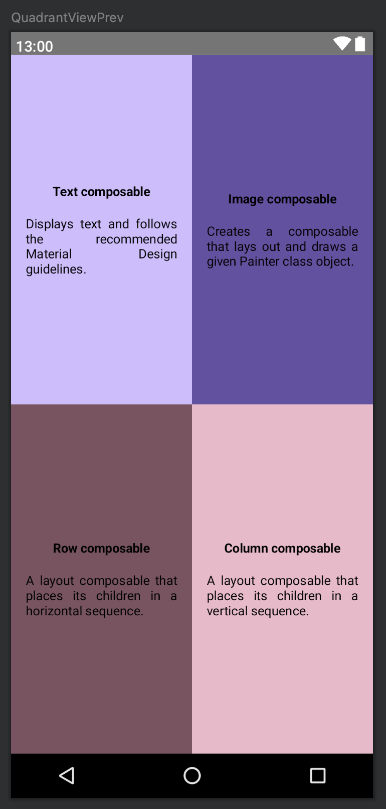
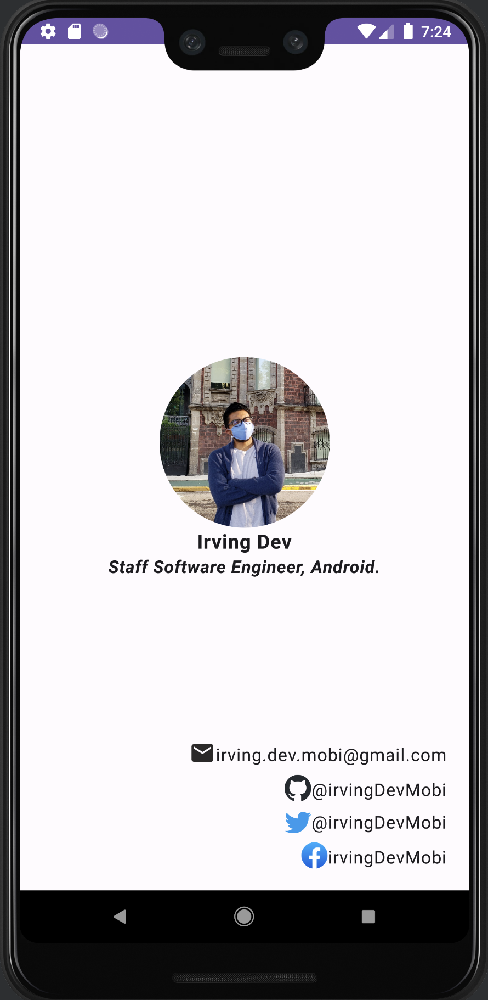

# BirthdayCard

Project of the Android Basics With Compose course, section First Android app -> Basic Layout
https://developer.android.com/courses/pathways/android-basics-compose-unit-1-pathway-3

Screens created in the course:

